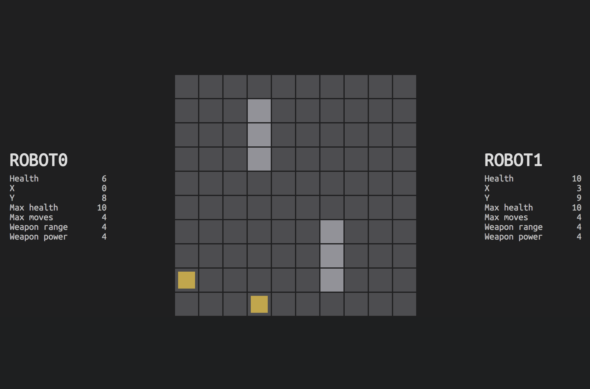

# RESTFight

**Game is currently higly WIP! Play at your own risk :)**

RESTFight is an AI programming game. In the turn based game two robots combat in an arena. The game is running on a web server and robots are controller via REST API so any language can be used to program the AI.

Robots can move around and shoot their opponents. There are also obstacles on the arena which robots should avoid. A robot has three primary properties: engine level, shield level and weapon level. Each property affects how the robot behaves. Robots has maximum load capacity and players need to balance properties to not overload the robot.

## Documentation

* [Game rules](game-rules.md)
* [API documentation (swagger.io)](https://app.swaggerhub.com/apis/jaamo/RESTFight/1.0.0)
* [Node based example robot](example-robot/README.md)

## Developer documentation

* [Game module documentation](restfight/README.md)
* [Web server documentation](main/README.md)

## Author

* Jaakko Alajoki, https://twitter.com/mrjaamo

